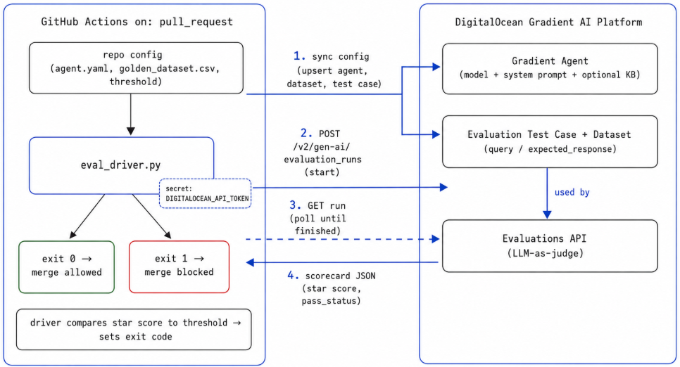

# Gradient Eval Gate

Regression-test a [DigitalOcean Gradient](https://www.digitalocean.com/products/ai-platform) agent in CI. The agent's configuration lives in this repository, so a change to its prompt, model, or threshold is a pull request. On every pull request the workflow syncs that configuration to the platform, scores the agent against a golden dataset through the Evaluations API, and fails the build when the correctness score drops below a threshold you set.

Because the configuration is version-controlled, the change that affects quality is the same change the gate evaluates. A silent agent regression becomes a red build, caught before it reaches a user.

## Architecture



<!-- Save the architecture diagram to assets/architecture.png -->

On each pull request, the workflow runs `sync_config.py` to push `config/agent.yaml` to the platform (the agent's instruction, model, and star-metric threshold), then runs `eval_driver.py` to start an evaluation run, poll it, read the star-metric score, and exit non-zero when it falls below the threshold. The golden dataset is uploaded once through the control panel and referenced by the test case.

## Prerequisites

- A DigitalOcean account with a payment method added.
- [`doctl`](https://docs.digitalocean.com/reference/doctl/how-to/install/), authenticated.
- Python 3.10 or newer.
- A DigitalOcean Personal Access Token with `genai` (create, read, update) and `project` (read) scopes.

## Setup

1. **Clone and install dependencies.**

   ```bash
   git clone https://github.com/mostafaibrahim18/gradient-eval-gate.git
   cd gradient-eval-gate
   pip install -r requirements.txt
   ```

2. **Configure environment variables.** Copy `.env.example` to `.env` and fill in the token and identifiers. `.env` is gitignored and must never be committed.

3. **Bootstrap once.** Create a Gradient agent (`doctl gradient agent create`), upload the golden dataset in `evaluations/`, and create an evaluation test case bound to the agent. Record the agent and test-case UUIDs.

4. **Point the config at your resources.** Set the UUIDs, model, instruction, and threshold in `config/agent.yaml`. From here on, edit this file to change the agent, not the control panel.

## Run it locally

```bash
python sync_config.py   # push config/agent.yaml to the platform
python eval_driver.py   # start, poll, score, and gate
```

`sync_config.py` updates the agent and test case from the config. `eval_driver.py` runs the evaluation, prints a PASS or FAIL line, and exits 0 or 1. That exit code is what CI keys on.

## How the CI gate works

The workflow at `.github/workflows/eval-gate.yml` triggers on every pull request. It syncs the config, then runs the driver, using the token from repository secrets and the identifiers from repository variables. If the score is below the threshold, the driver exits 1 and the job fails.

To block merges on a failing gate, add a required status check under **Settings → Branches** targeting `main` and select the `eval-gate` check. Required status checks are enforced on public repositories and on paid or organization plans.

## What lives where

The configuration that affects quality lives in Git; only the token and identifiers live in GitHub settings.

| Item | Location | Purpose |
|---|---|---|
| `instruction`, `model`, `star_threshold` | `config/agent.yaml` | Synced to the platform on every run |
| `golden_dataset.csv` | `evaluations/` | Uploaded once, referenced by the test case |
| `DIGITALOCEAN_API_TOKEN` | GitHub secret | Authenticates to the API |
| `AGENT_UUID`, `TEST_CASE_UUID`, `STAR_THRESHOLD` | GitHub variables | Passed to the driver |

## Repo structure

```
gradient-eval-gate/
├── .github/workflows/eval-gate.yml   CI: sync config, then run the gate
├── config/agent.yaml                 agent config (prompt, model, threshold), synced to the platform
├── evaluations/golden_dataset.csv    golden dataset (query, expected_response)
├── assets/architecture.png           architecture diagram
├── sync_config.py                    pushes config to the platform before scoring
├── eval_driver.py                    starts, polls, and gates the eval run
├── requirements.txt                  requests, python-dotenv, pyyaml
├── .env.example                      template for local configuration
└── README.md
```

## License

MIT